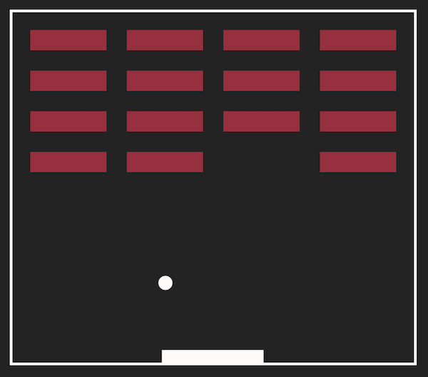

# Breakout Blocks

 \
**Website:** [aexcode-breakout-blocks.netlify.app](https://aexcode-breakout-blocks.netlify.app) \
**Author:** [aexcode](https://aexcode.com)

  

## Description:

Breakout blocks is a basic breakout game built with vanilla javascript and HTML5 Canvas. Play endlessly through various colorful rounds.

## Tech:

- HTML5 Canvas
- Vanilla Javascript

  

## Features:

- Users can begin a game, win a round, progress on to the next round, and play endlessly until they lose.
- Users can easilly restart the game once the game has been lost.
- Users can play with a mouse or keyboard (using left and right arrow keys).
- Mobile Responsive for **portrait orintation** [Check it out on Responsinator](https://www.responsinator.com/?url=https%3A%2F%2Faexcode-breakout-blocks.netlify.app)

## Future Updates:

- Improve mobile responsiveness for **landscape orientation**.
